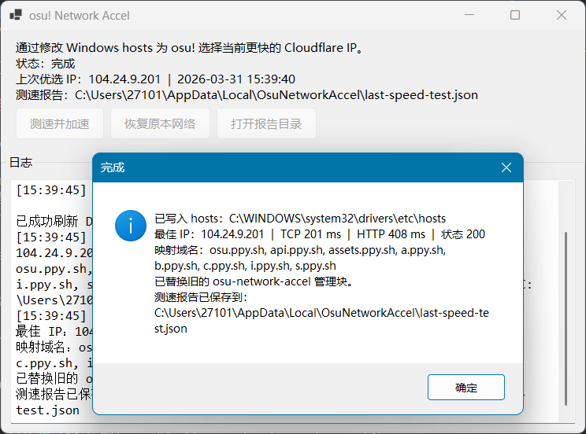

# osu-network-accel

一个带 GUI 的 Windows 小工具，通过修改 `hosts` 来加速 `osu!` 网络访问。

- 使用同一批 Cloudflare IPv4 网段做候选
- 每个网段随机抽样 2 个 IP
- 先做 TCP 443 初筛
- 再对前 8 个候选做 `osu.ppy.sh` 的 TLS/HTTP 复测
- 选出当前更快的 IP，写入 `hosts`

## 提供内容

- `OsuNetworkAccel.csproj`
  - 根目录项目文件
- `Program.cs`
  - GUI 程序入口
- `MainForm.cs`
  - 主窗口界面
- `AccelService.cs`
  - 测速、写入 `hosts`、恢复逻辑
- `publish-win-x64.ps1`
  - 单文件发布脚本

## 默认加速域名

程序会把同一个优选 IP 写到下面这些域名：

- `osu.ppy.sh`
- `api.ppy.sh`
- `assets.ppy.sh`
- `a.ppy.sh`
- `b.ppy.sh`
- `c.ppy.sh`
- `i.ppy.sh`
- `s.ppy.sh`

## 使用方式

### 打包发布

如果你要生成最终可分发的单文件程序，执行：

```powershell
powershell -ExecutionPolicy Bypass -File .\publish-win-x64.ps1
```

打包完成后，可分发目录默认是：

```text
publish\osu-network-accel-win-x64
```

这个目录里会只包含：

- `OsuNetworkAccel.exe`

这是自包含单文件版本，目标机器不需要安装 .NET Runtime，也不需要 C# 开发环境。

### 使用方式

双击 `OsuNetworkAccel.exe` 后，程序会以管理员权限启动，并提供两个按钮：

1. 进行测速
2. 把优选 IP 写入系统 `hosts`
3. 或恢复原本网络

恢复操作只会删除本工具写入的 `hosts` 管理块，不会动你原本其它的 `hosts` 内容。

## 本地命令行使用

### 构建

```powershell
dotnet build .\OsuNetworkAccel.csproj -c Release
```

## 输出

- 最新测速报告：`%LocalAppData%\OsuNetworkAccel\last-speed-test.json`

报告里会记录：

- 选中的 IP
- 参与复测的结果
- TCP / HTTP 延迟
- HTTP 状态码

## 注意事项

- 需要管理员权限，因为会修改系统 `hosts`
- 这是 `hosts` 级加速，核心是“强制把 osu 域名解析到当前更快的 Cloudflare IP”
- 如果你当前网络对某些 Cloudflare 节点本来就差，测速结果也可能不理想
- 恢复脚本只移除本项目生成的管理块，所以相对安全
